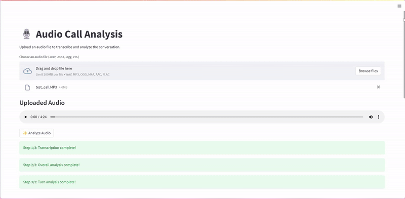

# AI-Powered Audio Call Analysis Pipeline

[](https://www.python.org/)
[](https://fastapi.tiangolo.com/)
[](https://ai.google.dev/)

This project provides a web application for analyzing audio call recordings using AI. It leverages Google's Gemini models via the `pydantic-ai` library to perform transcription, speaker diarization, emotion detection, turn-by-turn analysis (category, sentiment, translation), and overall call summarization.


The application consists of:

1.  **FastAPI Backend:** Handles API requests, interacts with the Gemini API for analysis, and serves the results.
2.  **Streamlit Frontend:** Provides a user-friendly interface to upload audio files and visualize the analysis results.

## Features

*   **Audio Transcription:** Transcribes the entire conversation from an uploaded audio file.
*   **Speaker Diarization:** Identifies and labels speakers (e.g., "Agent", "Customer", "Agent (Mohammed)").
*   **Timestamping:** Provides start and end times for each speaker turn.
*   **Emotion Detection:** Identifies the primary emotion for each turn.
*   **Turn-by-Turn Analysis:**
    *   **Category:** Classifies each turn (PII Stated, Product Issues, Complaint, Churn, Suggestion, None).
    *   **Sentiment:** Determines the sentiment (Positive, Negative, Neutral).
    *   **Translation:** Provides an English translation of the turn.
*   **Overall Call Analysis:**
    *   **Summarization:** Generates a concise summary of the call.
    *   **Call Purpose:** Identifies the main reason for the call.
    *   **Topics & Keywords:** Extracts key topics and keywords discussed.
    *   **Action Taken:** Lists actions completed *during* the call.
    *   **Next Action:** Lists follow-up actions agreed upon *after* the call.
*   **Web Interface:** Easy-to-use Streamlit dashboard for uploading audio and viewing analysis.

## Architecture

1.  **User Interaction (Streamlit):** The user uploads an audio file via the Streamlit web interface (`app.py`).
2.  **API Request (Streamlit -> FastAPI):** Streamlit sends the audio file to the FastAPI backend (`main.py`).
3.  **Transcription (FastAPI -> Gemini):** The `/transcribe` endpoint receives the audio, uses `pydantic-ai`'s `Transcritor_agent` to call the Gemini API, requesting transcription, speaker diarization, timestamps, and emotion detection according to the `AudioAnalysis` schema.
4.  **Analysis (FastAPI -> Gemini):** Based on the user's interaction or subsequent requests triggered by the frontend:
    *   The `/analyze-turns` endpoint receives the transcription data (`AudioAnalysis` JSON), uses `call_analyzer_agent` to call Gemini, requesting turn category, sentiment, and translation, formatted as `CallAnalysis`.
    *   The `/analyze-call` endpoint receives the transcription data (`AudioAnalysis` JSON), uses `overallcall_analyzer_agent` to call Gemini, requesting summary, purpose, topics, and actions, formatted as `OverallCallAnalysisResult`.
5.  **API Response (FastAPI -> Streamlit):** FastAPI returns the structured JSON results (transcription, turn analysis, overall analysis) to Streamlit.
6.  **Display Results (Streamlit):** Streamlit parses the JSON responses and displays the analysis results in a user-friendly format (text summaries, tables).

## Technology Stack

*   **Backend:** Python, FastAPI, Uvicorn
*   **Frontend:** Streamlit
*   **AI Interaction:** `pydantic-ai`
*   **AI Model:** Google Gemini API (specifically `gemini-2.5-pro-exp-03-25` or similar multimodal model)
*   **Environment Variables:** `python-dotenv`
*   **Data Validation:** Pydantic

## Setup and Installation

**Prerequisites:**

*   Python 3.8 or higher
*   Access to Google Cloud Platform and the Gemini API enabled for your project.
*   A Google Cloud API Key with permissions for the Gemini API.

**Steps:**

1.  **Clone the Repository:**
    ```bash
    git clone https://github.com/hudasaleh97188/AI-Agents/DeepCallsAnalysis
    cd DeepCallsAnalysis
    ```

2.  **Create and Activate a Virtual Environment:**
    ```bash
    # Linux/macOS
    python3 -m venv venv
    source venv/bin/activate

    # Windows
    python -m venv venv
    .\venv\Scripts\activate
    ```

3.  **Install Dependencies:**
    Create a `requirements.txt` file with the necessary packages:
    ```txt
    # requirements.txt
    fastapi>=0.100.0
    uvicorn[standard]>=0.20.0
    streamlit>=1.20.0
    requests>=2.28.0
    pydantic>=2.0.0
    pydantic-ai>=1.0.0 # Check for the latest version
    google-generativeai>=0.3.0 # Check for the latest version compatible with pydantic-ai
    python-dotenv>=1.0.0
    pandas>=1.5.0 # For Streamlit display
    ```
    Then install them:
    ```bash
    pip install -r requirements.txt
    ```
    *(Note: You might need to adjust version numbers based on compatibility, especially between `pydantic-ai` and `google-generativeai`)*

4.  **Configure Environment Variables:**
    Create a file named `.env` in the root directory of the project and add your Google API key:
    ```env
    # .env
    GOOGLE_API_KEY=YOUR_GEMINI_API_KEY_HERE
    ```
    The application uses `python-dotenv` to load this key.

5.  **Run the Backend (FastAPI):**
    Open a terminal, activate the virtual environment, and run:
    ```bash
    uvicorn main:app --host 0.0.0.0 --port 8001 --reload
    ```
    The backend API will be available at `http://localhost:8001`. The `--reload` flag automatically restarts the server when code changes are detected (useful for development).

6.  **Run the Frontend (Streamlit):**
    Open *another* terminal, activate the virtual environment, and run:
    ```bash
    streamlit run app.py
    ```
    The Streamlit application will typically open automatically in your web browser at `http://localhost:8501`.

## Usage

1.  Navigate to the Streamlit application URL (usually `http://localhost:8501`).
2.  Use the file uploader to select an audio file (e.g., `.wav`, `.mp3`, `.m4a`).
3.  An audio player will appear for you to listen to the uploaded file.
4.  Click the "✨ Analyze Audio" button.
5.  Wait for the analysis steps to complete (Transcription, Overall Analysis, Turn Analysis). Progress indicators will be shown.
6.  View the results:
    *   The "Overall Call Analysis" section displays the summary, purpose, topics, and actions.
    *   The "Turn-by-Turn Analysis" section shows a table with details for each segment of the conversation, including speaker, category, sentiment, translation, and a snippet of the transcript.

## API Endpoints (FastAPI - `main.py`)

*   **`POST /transcribe`**
    *   **Input:** Audio file (`UploadFile`).
    *   **Output:** JSON conforming to the `AudioAnalysis` Pydantic model (transcription, speaker, time, emotion).
*   **`POST /analyze-turns`**
    *   **Input:** JSON payload conforming to the `AudioAnalysis` model.
    *   **Output:** JSON conforming to the `CallAnalysis` Pydantic model (list of turn analyses: category, sentiment, translation).
*   **`POST /analyze-call`**
    *   **Input:** JSON payload conforming to the `AudioAnalysis` model.
    *   **Output:** JSON conforming to the `OverallCallAnalysisResult` Pydantic model (summary, purpose, topics, actions).

## Configuration

*   **AI Model:** The Gemini model used (`gemini-2.5-pro-exp-03-25`) is specified within the `Agent` initializations in `main.py`. You may need to update this based on model availability or your requirements.
*   **API Key:** Ensure the `GOOGLE_API_KEY` is correctly set in the `.env` file.
*   **Backend Port:** The FastAPI backend runs on port `8001` by default (defined in the `uvicorn.run` command).
*   **Frontend Port:** Streamlit runs on port `8501` by default.
