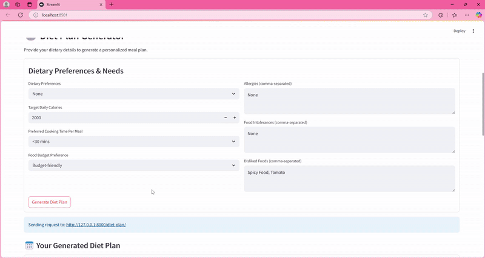

# AI Health Assistant 🧠🥗🏃🩺

A personalized health assistant powered by AI agents (using CrewAI) designed to provide tailored guidance on diet, fitness, mental wellness, and informational support for chronic conditions. It features a FastAPI backend and a user-friendly Streamlit frontend.


## ✨ Features

*   **🥗 Personalized Diet Plans:** Generates multi-day meal plans based on user preferences (vegan, keto, etc.), allergies, intolerances, calorie goals, cooking time, and budget.
*   **🏃 Customized Fitness Routines:** Creates workout plans tailored to fitness level, goals, available equipment, time constraints, and preferred activities. Includes warm-ups, exercises (sets/reps), and cool-downs.
*   **🧠 Mental Wellness Support:** Offers informational support, stress management techniques (inspired by CBT), guided meditation ideas, and relaxation exercises based on user-reported concerns and triggers.
*   **🩺 Chronic Condition Informational Support:** Provides general lifestyle tips (diet, exercise, sleep) and informational resources related to managing user-specified chronic conditions. **(Disclaimer: This is NOT medical advice)**.
*   **🤖 AI Agent-Powered:** Leverages CrewAI to orchestrate specialized AI agents (Dietitian, Fitness Coach, Mental Wellness Assistant, Chronic Support Info) using Google Gemini.
*   **🌐 Web Interface:** Easy-to-use frontend built with Streamlit for data collection and results display.
*   **⚙️ API Backend:** Robust FastAPI backend serving the AI capabilities.

## 🛠️ Tech Stack

*   **Backend:**
    *   Python 3.x
    *   FastAPI: For building the REST API.
    *   CrewAI: For multi-agent AI orchestration.
    *   LangChain: Core library used by CrewAI.
    *   Pydantic: For data validation and settings management.
    *   Google Gemini: LLM accessed via CrewAI/LangChain integration.
    *   DuckDuckGoSearchRun: For agent web searches.
    *   Uvicorn: ASGI server for FastAPI.
*   **Frontend:**
    *   Streamlit: For creating the interactive web application.
    *   Requests: For communicating with the FastAPI backend.


## 📁 Project Structure (Example)
eunoia-ai-health-assistant/
├── crew.py # <-- FastAPI app, CrewAI agents, tasks, crews setup
├── app.py # <-- Streamlit frontend application
├── schemas.py # <-- Pydantic models for input/output data
├── requirements.txt # <-- Python dependencies
└── README.md # <-- This file


## 🚀 Getting Started

Follow these steps to set up and run the project locally.

### Prerequisites

*   Python 3.9+
*   Git
*   Access to Google Gemini API and a valid API Key.

### Installation

1.  **Clone the repository:**

2.  **Create a virtual environment (recommended):**
    ```bash
    python -m venv venv
    # On Windows
    .\venv\Scripts\activate
    # On macOS/Linux
    source venv/bin/activate
    ```

3.  **Install dependencies:**
    ```bash
    pip install -r requirements.txt
    ```

4.  **Set up Environment Variables:**
    *   Add your Google Gemini API key 

### Running the Application

You need to run the backend (FastAPI) and the frontend (Streamlit) simultaneously, typically in separate terminal windows.

1.  **Start the FastAPI Backend:**
    *   Make sure your virtual environment is activated.
    *   Run Uvicorn:
        ```bash
        uvicorn crew:app --reload --host 0.0.0.0 --port 8000
        ```
    *   The backend API should now be running on `http://127.0.0.1:8000`. You can access the interactive API docs at `http://127.0.0.1:8000/docs`.

2.  **Start the Streamlit Frontend:**
    *   Open a *new* terminal window/tab.
    *   Make sure your virtual environment is activated in this new terminal as well.
    *   Run Streamlit:
        ```bash
        # Assuming your Streamlit code is in 'app.py'
        streamlit run app.py
        ```
    *   Streamlit will automatically open the application in your default web browser, usually at `http://localhost:8501`.

## 📝 Usage

1.  Open the Streamlit application in your browser (e.g., `http://localhost:8501`).
2.  Fill in the **General Information** section at the top. This information is used across different features.
3.  Navigate to the desired tab:
    *   **🥗 Diet Plan:** Enter dietary preferences, restrictions, goals, etc., and click "Generate Diet Plan".
    *   **🏃 Fitness Plan:** Input fitness level, goals, equipment, time, etc., and click "Generate Fitness Plan".
    *   **🧠 Mental Wellness Support:** Provide details about concerns, triggers, sleep, etc., and click "Get Mental Wellness Support".
    *   **🩺 Chronic Condition Support:** Ensure the relevant conditions are listed in the General Information section and click "Get Chronic Condition Support".
4.  Wait for the AI agents to process the request and generate the output.
5.  The results will be displayed in a structured format within the Streamlit app.

## ⚙️ API Endpoints

The FastAPI backend exposes the following endpoints (running on `http://127.0.0.1:8000` by default):

*   `POST /diet-plan/`: Accepts `general_user` and `diet_user` JSON data, returns a `MealPlan`.
*   `POST /fitness-plan/`: Accepts `general_user` and `fitness_user` JSON data, returns a `FitnessPlan`.
*   `POST /mental-support/`: Accepts `general_user` and `wellness_user` JSON data, returns generated text support.
*   `POST /chronic-support/`: Accepts `general_user` JSON data, returns generated text support.

Refer to the Pydantic models in `schemas.py` (or equivalent file) for the exact input/output structures and access `http://127.0.0.1:8000/docs` for interactive testing.

